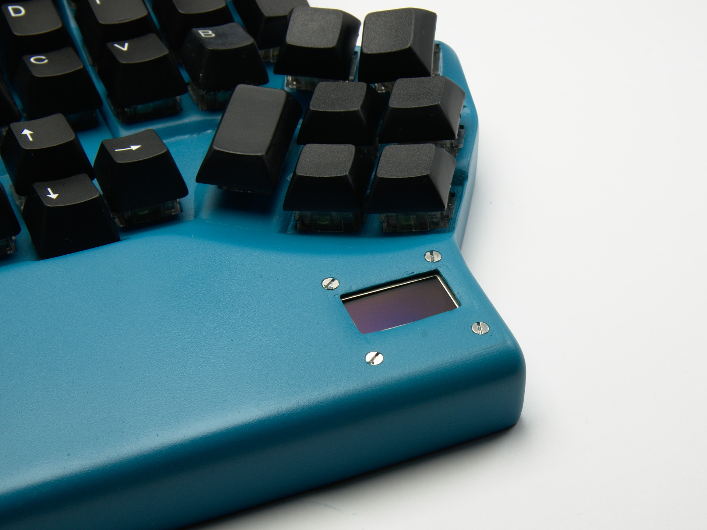

thekbd
======

My custom keyboard projec

Ideas taken from The ErgoDox, AcidFire's project, The Kinesis Advantage, Maltron keyboards and many other projects found at http://geekhack.org/ and http://deskthority.net/
The controller is an Arduino Micro. The firmware is as simple as it can be done (at least for mk1).

I've made two different versions:
1. ErgoDox like keyboard (mk1). It is handwired and made of 5mm think plexiglass sheets. It uses Cherry MX Blue switches.
2. Split contour keyboard (mk2). It is handwired and 3d printed. It uses Matias Quiet Click switches. It has an OLED display 128x64 (SSD1306).

**Uses Arduino as the base for the firmware.**

|         | Info for the repo:                                            |
|--------:|:--------------------------------------------------------------|
|*URL:*   | https://github.com/arduino/Arduino.git                        |
|*Commit:*| tag 1.6.9 with hash: 3434cf6b09b465a917be752efde608f7ea5a4343 |

**HID Library used (placed in libraries/HID):**

|         | Info for the repo:                                            |
|--------:|:--------------------------------------------------------------|
|*URL:*   | https://github.com/keyboardio/HID.git                         |
|*Commit:*| 490350650f9b9bf859ae8d16a0a77eab1d362637                      |

The firmware is developed inside Code::Blocks IDE on Gentoo Linux.

 ### mk2 notes

* The connection to the right side of the keyboard is done using a I2C port expander (mpc23017). The I2C is running at the maximum frequency for the AVR hardware 400 kHz.
* It has a monochrome OLED display which uses the SSD1306 controller. It is used to display the current active layer. The code for drawing on the display is based on the Adafruit's code, but font drawing is something like 4x faster (and it could probably be made even faster if needed).
* The current implementation does 1000 iterations for 2530 ms or 395.256 Hz. This is while using the Arduinos I2C library and also using digitalRead/digitalWrite calls. Both aren't really that fast.
