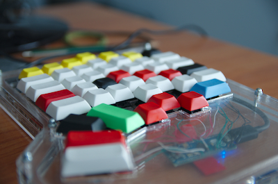

thekbd
======

My custom keyboard project

Ideas taken from The ErgoDox, AcidFire's project and many other projects found at http://geekhack.org/ and http://deskthority.net/
The controller is an Arduino Micro. The firmware is as simple as it can be done.

The commit in the Arduino project that is used to build the code is 1918966aefd33a63a75b06485d5bb98397b629a1.
